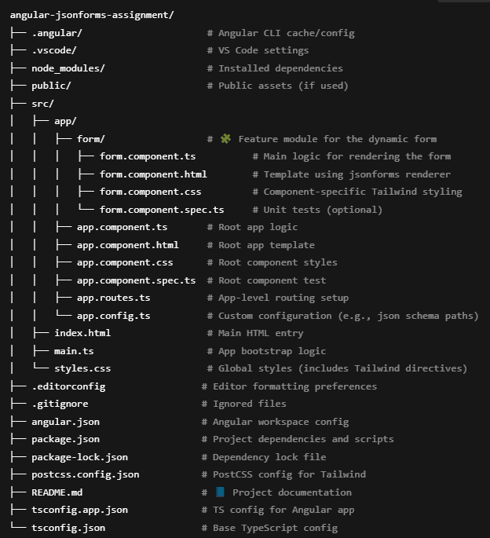

# 🧩 Angular JSON Forms Project – Technical Assignment

## 📌 Objective

This project was built as a part of a technical assignment to evaluate the understanding of:
- Angular (v15 preferred)
- JSON-based dynamic forms using the [`jsonforms.io`](https://jsonforms.io) library
- Custom Angular renderers
- Tailwind CSS for responsive UI design and styling

The goal was to build a dynamic form generator that renders UI from JSON schema/configurations, adheres to design guidelines, and includes customizations, responsiveness, and validations.

---

## 📁 Project Structure



---

## 🚀 Getting Started

### 1️⃣ Clone the Repository

```bash
git clone https://github.com/<your-username>/<repo-name>.git
cd <repo-name>
2️⃣ Install Dependencies
bash
Copy
Edit
npm install
3️⃣ Run the App Locally
bash
Copy
Edit
ng serve
Navigate to http://localhost:4200/ in your browser.

🛠️ Technologies Used
Tech	Description
Angular 15	Framework for SPA development
jsonforms.io	Dynamic form generation from JSON
Tailwind CSS	Utility-first CSS framework
TypeScript	Superset of JavaScript
HTML/CSS	Markup and styling

📐 JSON Schema & UI Schema
The project uses two sample sets of schemas:

✅ Sample 1: Basic Personal Form
json
Copy
Edit
// schemas/schema-personal.json
{
  "type": "object",
  "properties": {
    "firstName": { "type": "string" },
    "age": { "type": "integer", "minimum": 0 },
    "gender": { "type": "string", "enum": ["Male", "Female", "Other"] }
  },
  "required": ["firstName", "age"]
}
json
Copy
Edit
// schemas/ui-schema-personal.json
{
  "type": "VerticalLayout",
  "elements": [
    { "type": "Control", "scope": "#/properties/firstName" },
    { "type": "Control", "scope": "#/properties/age" },
    { "type": "Control", "scope": "#/properties/gender" }
  ]
}
✅ Sample 2: Address Form with Conditional Dropdown
Includes a dynamic dropdown for country → updates states dynamically using Angular logic in a custom renderer.

🎨 Custom Renderers
A custom renderer was implemented for the gender field using a custom Angular component (gender-select.component.ts) styled with Tailwind. It replaces the default dropdown with a more accessible UI element.

📱 Responsive UI & Tailwind Styling
Tailwind classes were used to style all layouts

Components are mobile-friendly and responsive

UI follows consistent spacing, padding, and alignment

✅ Form Validations
Real-time validation feedback for required and min/max fields

Error messages display inline

One dropdown (country → states) affects another field dynamically

🧪 Phased Implementation
Phase 1: Project Setup
Angular 15 initialized

Tailwind and jsonforms.io configured

Phase 2: Dynamic Forms with JSON
Rendered forms dynamically using JSON schema and UI schema

Phase 3: Custom Renderers
Replaced default dropdown with a custom-rendered select component

Phase 4: Styling & Responsiveness
UI built using Tailwind, fully responsive across devices

Phase 5: Validations & Interactions
Added live field validation and conditional dropdown interaction

Phase 6: Final Touches
Code cleanup and documentation added

